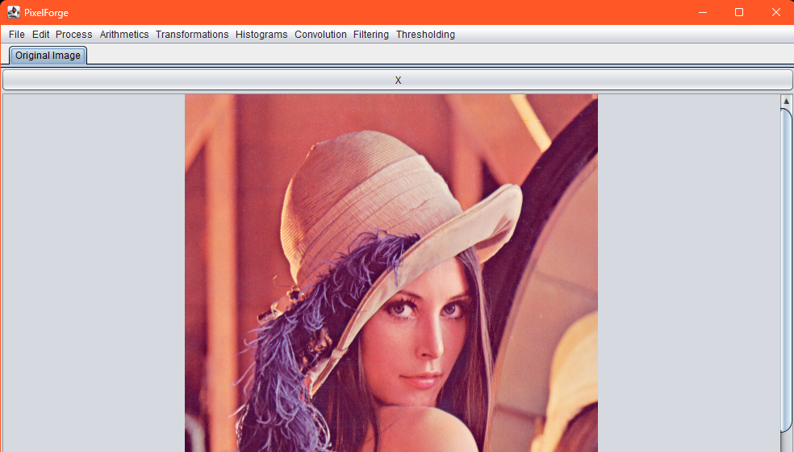
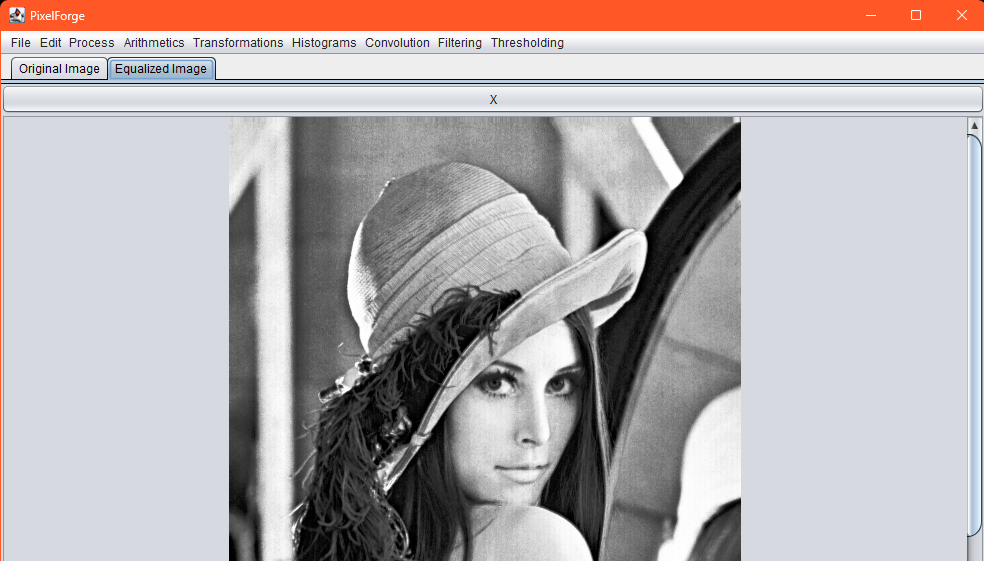
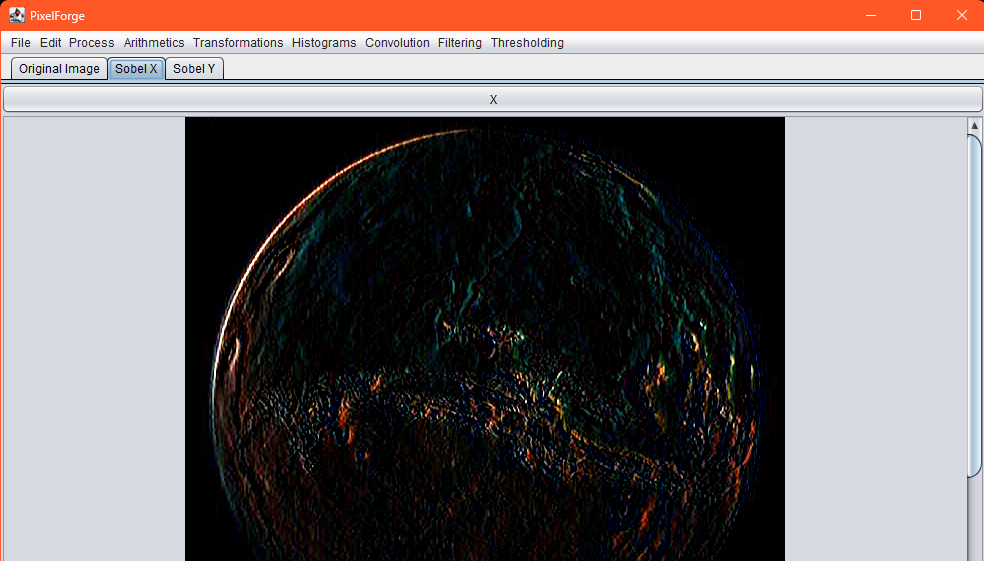
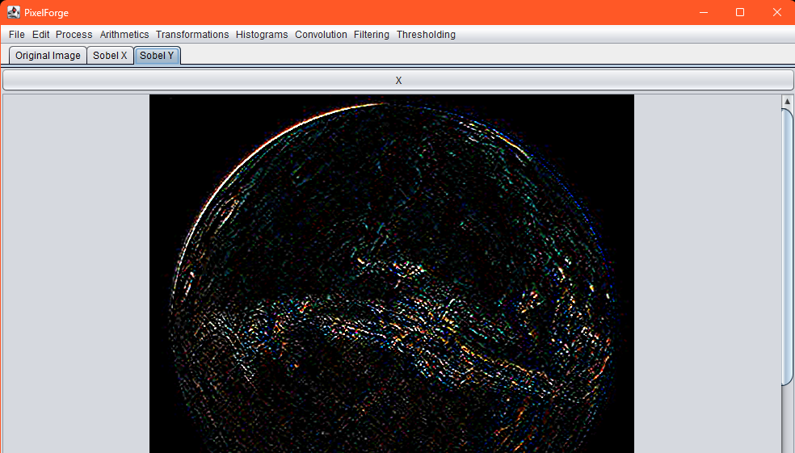

# 🖼️ Image Processing Application

Welcome to the **Image Processing Application** repository! This project is a Java-based desktop application for advanced image manipulation and processing. It provides a wide range of features for editing and analyzing images, all wrapped in a sleek and user-friendly interface.

---

## 🌟 **Project Overview**

The goal of this project is to provide a comprehensive tool for image processing, including:

- **Basic Operations**: Rescaling, shifting, and shift-rescaling.
- **Color Transformations**: Negative image, grayscale conversion.
- **Arithmetic Operations**: Addition, subtraction, multiplication, and division of images.
- **Transformations**: Power-law (gamma) transform, log transform, bit-plane slicing, and random lookup table (LUT).
- **Histogram Operations**: Histogram calculation, normalization, and equalization.
- **Convolution Filters**: Smoothing, edge detection (Roberts, Sobel, Laplacian), and noise reduction (Gaussian, median filter).
- **Thresholding**: Simple and automated thresholding for image segmentation.
- **Noise Addition and Filtering**: Salt-and-pepper noise, min, max, midpoint, and median filters.

---

## 💻 **Tech Stack**

    

---

## 🚀 **Key Features**

### **Image Manipulation**
- **Rescaling**: Adjust image size by a user-defined scale factor.
- **Shifting**: Shift pixel intensities by a user-defined value.
- **Shift-Rescaling**: Combine shifting and rescaling for dynamic adjustments.

### **Color Transformations**
- **Negative Image**: Invert pixel values to create a negative effect.
- **Grayscale Conversion**: Convert images to grayscale using luminance weighting.

### **Arithmetic Operations**
- Perform pixel-wise addition, subtraction, multiplication, and division of two images.

### **Transformations**
- **Power-law Transform**: Apply gamma correction for contrast adjustment.
- **Log Transform**: Enhance details in darker regions of the image.
- **Bit-plane Slicing**: Extract specific bit planes for analysis or visualization.
- **Random LUT**: Apply a random lookup table for creative effects.

### **Histogram Operations**
- **Histogram Calculation**: Display pixel intensity distribution.
- **Histogram Equalization**: Improve image contrast by equalizing the histogram.

### **Convolution Filters**
- **Smoothing**: Apply averaging and weighted averaging filters for noise reduction.
- **Edge Detection**: Use Roberts, Sobel, and Laplacian filters to detect edges.
- **Noise Reduction**: Apply Gaussian and median filters to reduce noise.

### **Thresholding**
- **Simple Thresholding**: Convert images to binary using a user-defined threshold.
- **Automated Thresholding**: Automatically determine the threshold for binarization.

### **Noise Addition and Filtering**
- **Salt-and-Pepper Noise**: Add noise to simulate real-world image degradation.
- **Min, Max, Midpoint, and Median Filters**: Reduce noise and preserve details.

---

## 🖥️ **User Interface**
- **Modern Design**: Built using **Swing** and **FlatLaf** for a sleek and professional look.
- **Tabbed Interface**: Manage multiple images and operations in separate tabs.
- **Undo/Redo**: Stack-based undo/redo functionality for seamless editing.
- **Splash Screen**: A welcoming splash screen for better user experience.
- **Default Image Placeholder**: Display a default image when no image is uploaded.

---

## ⚙️ **Setup Instructions**

To set up this project on your local system, follow these steps:

1. **Clone the Repository**

   ```bash
   git clone https://github.com/smooth-glitch/pixelForge.git
   cd image-processing-app
   ```

2. **Compile and Run**

   ```bash
   javac Lab1.java
   java Lab1
   ```

3. **Access the Application**
   - Open the application and start processing images using the intuitive menu options.

---

## 📁 **Project Structure**

```
image-processing-app/
├── icons/                  # Icons for menu items
├── Lab1.java               # Main application file
├── Lab2.java               # Rescaling and shifting logic
├── Lab4.java               # Transformations (log, power-law, bit-plane slicing, random LUT)
├── Lab5.java               # Histogram operations
├── Lab6.java               # Convolution filters
├── Lab7.java               # Noise addition and filtering
├── Lab8.java               # Thresholding
└── README.md               # Project documentation
```

---

## 📸 **Screenshots**

### **Main Interface**


### **Histogram Equalization**


### **Edge Detection (Sobel Filter)**



---

## 🤝 **Contribution**

If you'd like to contribute to this project, please follow these steps:
1. Fork the repository.
2. Create a new branch for your feature or bug fix.
3. Commit your changes.
4. Submit a pull request with a detailed description of your changes.

---

## 📜 **License**

This project is licensed under the **Apache 2.0 License**. See the [LICENSE](LICENSE) file for more details.

---

## 📧 **Contact**

For any questions or feedback, feel free to reach out:

- **Email**: arjunsridhar445@gmail.com
- **GitHub**: [smooth-glitch](https://github.com/smooth-glitch)

---
